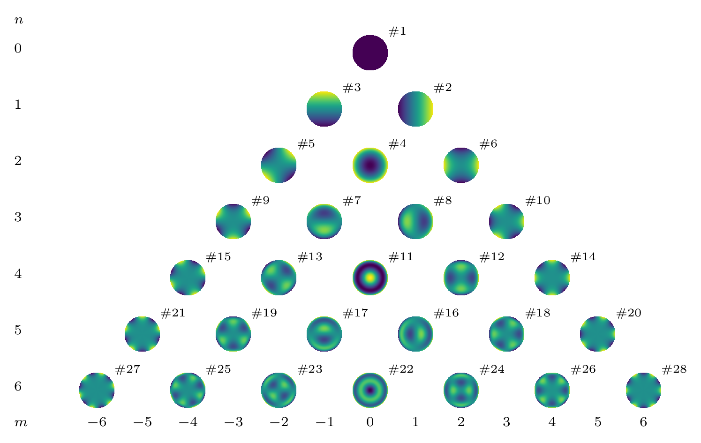

# Zernike

[](https://doi.org/10.1364/JOSAA.32.001160)

Python code to handle complex- and real-valued Zernike polynomials. This module
was part of [enzpy](https://github.com/jacopoantonello/enzpy) but will be
further developed here instead.



## Installation

You can install `zernike` using `pip`

```bash
pip install --user zernike
```

## Example: plot the first 9 Zernike polynomials

```python
import numpy as np
import matplotlib.pyplot as plt
from zernike import RZern

cart = RZern(6)
L, K = 200, 250
ddx = np.linspace(-1.0, 1.0, K)
ddy = np.linspace(-1.0, 1.0, L)
xv, yv = np.meshgrid(ddx, ddy)
cart.make_cart_grid(xv, yv)

c = np.zeros(cart.nk)
plt.figure(1)
for i in range(1, 10):
    plt.subplot(3, 3, i)
    c *= 0.0
    c[i] = 1.0
    Phi = cart.eval_grid(c, matrix=True)
    plt.imshow(Phi, origin='lower', extent=(-1, 1, -1, 1))
    plt.axis('off')

plt.show()
```

## Example: fit Zernike polynomials in Cartesian coordinates

```python
import numpy as np
import matplotlib.pyplot as plt
from zernike import RZern

cart = RZern(6)
L, K = 200, 250
ddx = np.linspace(-1.0, 1.0, K)
ddy = np.linspace(-1.0, 1.0, L)
xv, yv = np.meshgrid(ddx, ddy)
cart.make_cart_grid(xv, yv)

c0 = np.random.normal(size=cart.nk)
Phi = cart.eval_grid(c0, matrix=True)
c1 = cart.fit_cart_grid(Phi)[0]
plt.figure(1)
plt.subplot(1, 2, 1)
plt.imshow(Phi, origin='lower', extent=(-1, 1, -1, 1))
plt.axis('off')
plt.subplot(1, 2, 2)
plt.plot(range(1, cart.nk + 1), c0, marker='.')
plt.plot(range(1, cart.nk + 1), c1, marker='.')

plt.show()
```

## Example: fit Zernike polynomials in polar coordinates

```python
import numpy as np
from zernike import RZern, FitZern

pol = RZern(6)
L, K = 200, 250
ip = FitZern(pol, L, K)

pol.make_pol_grid(ip.rho_j, ip.theta_i)
c_true = np.random.normal(size=pol.nk)
Phi = pol.eval_grid(c_true)
c_hat = ip.fit(Phi)
R = np.zeros((pol.nk, 3))
R[:, 0] = c_true
R[:, 1] = c_hat
R[:, 2] = np.abs(c_true - c_hat)
print(R)
np.linalg.norm(c_true - c_hat)/np.linalg.norm(c_true)
```

## Installation from the GitHub repository

- You should first install the following requirements:
    - [Anaconda for Python 3](https://www.anaconda.com/download). This includes
      Python as well as some necessary scientific libraries.
    - [Git](https://git-scm.com/download/win). This is necessary for the
      automatic version numbering of this package. Also, make sure you choose
      *Git from the command line and also 3rd-party software* in *Adjusting
      your PATH environment*.
- *Clone* this repository using Git. From any folder in File Explorer,
  right-click and hit *Git Bash here*. Paste `git clone
  https://github.com/jacopoantonello/zernike` and hit enter. Do not use
  GitHub's *Download ZIP* button above, as the installation script will not
  work in that case.
- Finally, double-click on `install.bat`.

## Tests

```bash
python -m zernike.test
```
